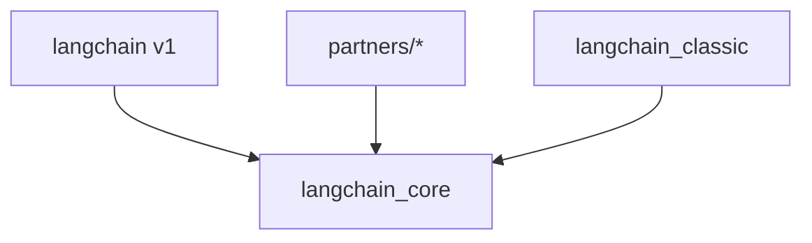

# LangChain 边界地图

> 第 2 周交付物 | 本阶段禁止读超过 50 行的实现文件

---

## 1. 包依赖图

> 若 mermaid 不可用，用 ASCII 手绘替代。

---

## 2. 各包职责

### langchain_core

- **路径**：`/home/zym/langchain/libs/core/langchain_core/`
- **依赖**：（从 pyproject.toml 摘录）
- **职责**：
- **子目录地图**：

| 子目录 | 职责 |
|--------|------|
| `runnables/` | |
| `language_models/` | |
| `messages/` | |
| `tools/` | |
| `prompts/` | |
| `output_parsers/` | |
| `vectorstores/` | |
| `callbacks/` | |

### langchain v1

- **路径**：`/home/zym/langchain/libs/langchain_v1/langchain/`
- **依赖**：
- **职责**：

| 子目录 | 职责 |
|--------|------|
| `agents/` | |
| `chat_models/` | |
| `tools/` | |
| `embeddings/` | |
| `messages/` | |

### partners（抽样）

| Partner | 依赖 | 公开入口 |
|---------|------|----------|
| openai | | |
| ollama | | |

---

## 3. Public API 入口

### Core 公开符号（从 `__init__.py` / `__all__` 整理）

| 分类 | 符号 | 定义文件 |
|------|------|----------|
| Runnable | | |
| Messages | | |
| Tools | | |

### v1 公开符号

| 分类 | 符号 | 定义文件 |
|------|------|----------|
| Agent | | |
| ChatModel | | |

---

## 4. Internal 信号

| 信号 | 含义 | 示例 |
|------|------|------|
| `_` 前缀模块/函数 | | `_api/` |
| 未在 `__all__` 中导出 | | |
| `py.typed` 存在 | 类型检查约定 | |

---

## 5. 符号定位练习记录（过关用）

> 随机抽 10 个符号，计时定位所在包。

| 符号 | 所在包 | 文件路径 | 耗时 |
|------|--------|----------|------|
| Runnable | | | |
| init_chat_model | | | |
| BaseTool | | | |
| ChatOpenAI | | | |
| | | | |

**总耗时**：____ 分钟（目标 ≤ 15 分钟）
